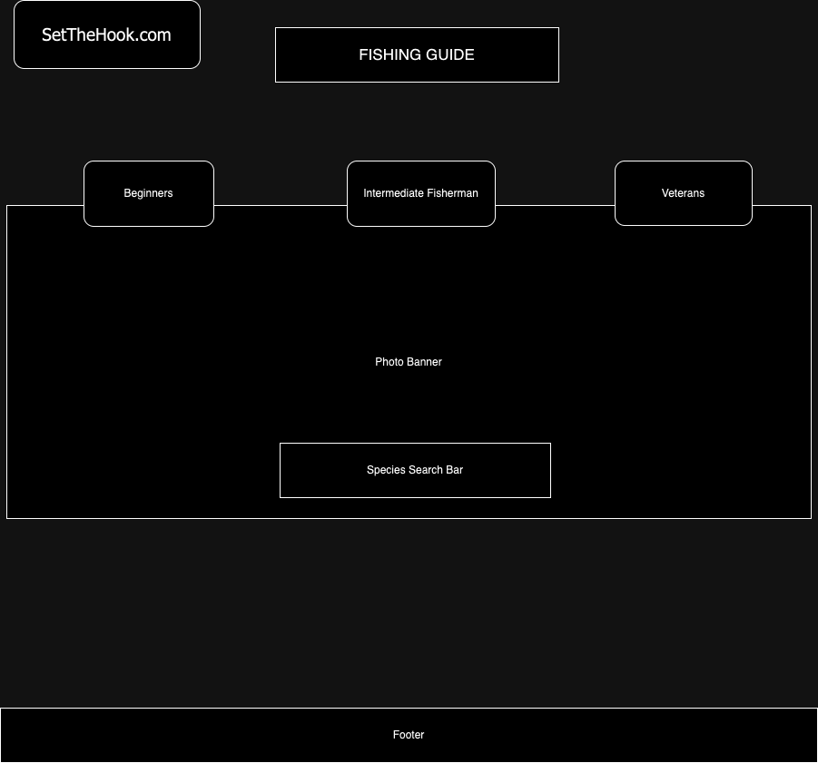

# Fishing_dictionary
This application gives information about different species of fish, and how and where you can catch them.

##features:
1. search for different species of fish and how to fish for them

2. Find species based on difficulty level

3. Find species based on other attributes such as temperment

##technology used:
1. front-end: HTML, CSS, Flex-Box

2. back-end: Mongo, Axios, Mongoose, body-parser, morgan

3. middleware: Express, Cors

