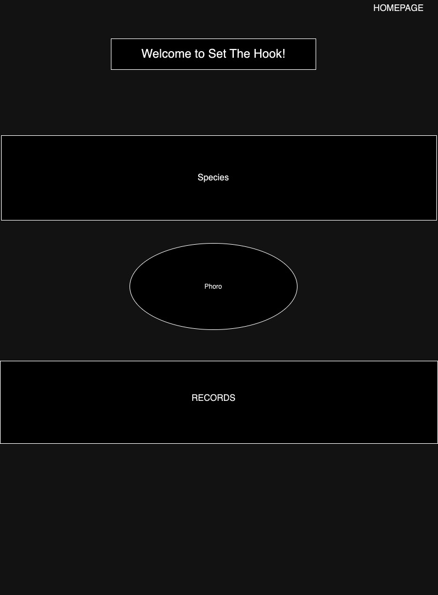

# Fishing_dictionary
This application gives information about different species of fish, and how and where you can catch them.

##features:
1. search for different species of fish and how to fish for them

2. Find species based on difficulty level

3. Find species based on other attributes such as temperment

##technology used:
1. front-end: HTML, CSS, Flex-Box

2. back-end: Mongo, Axios, Mongoose, body-parser, morgan

3. middleware: Express, Cors

## Things I enjoyed

1. I love fishing so I feel like this was the right choice in what I should've done. It was easy if I got stuck to push through a little more because it's something i enjoy.

2. Watching everything come together a little bit more after styling. I didn't do any styling until the last day so it wasnt very aesthetically pleasing until yesterday but it was very pleasing to see it come together finally.

## Things I struggled with

1. Planning: I think if I had done more planning I could have gotten more done/had more time to just execute my plans. More wireframes and a stronger idea of what I was going to do would have helped.

2. Taking a break and coming back with a fresh mind: I would sit there and force myself to complete a certain amount of work but I noticed if I took a break and came back I more often would be able to solve my problem much easier.

3. Understanding how files must be arranged: I was stuck trying to fix my images for probably a couple hours and I moved my images folder to every possible place besides the client folder. Once I moved them there It totally clicked but that was frustrating.

## TakeAways

1. Sometimes errors or even a project as a whole may seem daunting but in the end I always end up learning something and usually I learn a lot.

2. Ask for help more often. Sometimes I don't want to ask for help and just want to figure something out on my own but asking for help from either an instructor or classmate would be very helpful in some of the spots I got in like with my images.

3. Retaining information happens through repetition. Sometimes I would look back at something I coded and completely forget how it worked. Taking notes is very helpful both for retention and looking back and referencing past lessons and such